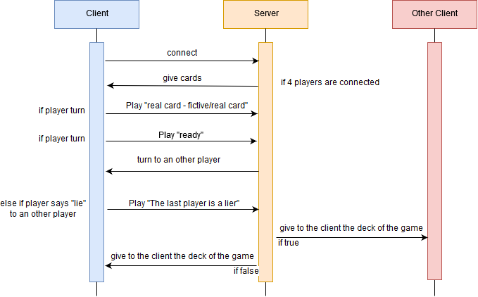

# L♣️e♦️a♠️t♥️
The But of Leat (portmanteau of the words « Lie » and «Cheat») game is to get rid as soon as possible of all the cards we have in hand.

## What does it use?
  - Java
  - Netty

## How does it work ?

## How to Play ?
1. You need 4 clients connected.
2. Players turn a card over the previous one, but face down, announcing a value at the top like "8Trefle 9Carreau" or "8Trefle 8Trefle".
3. When one of the players to a suspicion on the card announced by the player coming to put the card, he must say  "/lie"
4. If the player who posed the card lied, he has to pick up all the piles of accumulated cards. Else if the player didn't lie, the one who announced "/lie" picks up all the cards from the heap.
  
## Can I help you?
Of course ! By hitting the :star: button !
